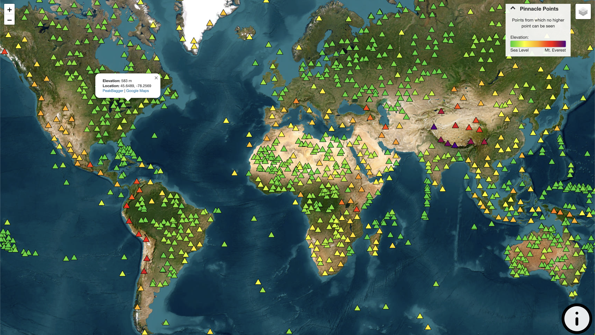
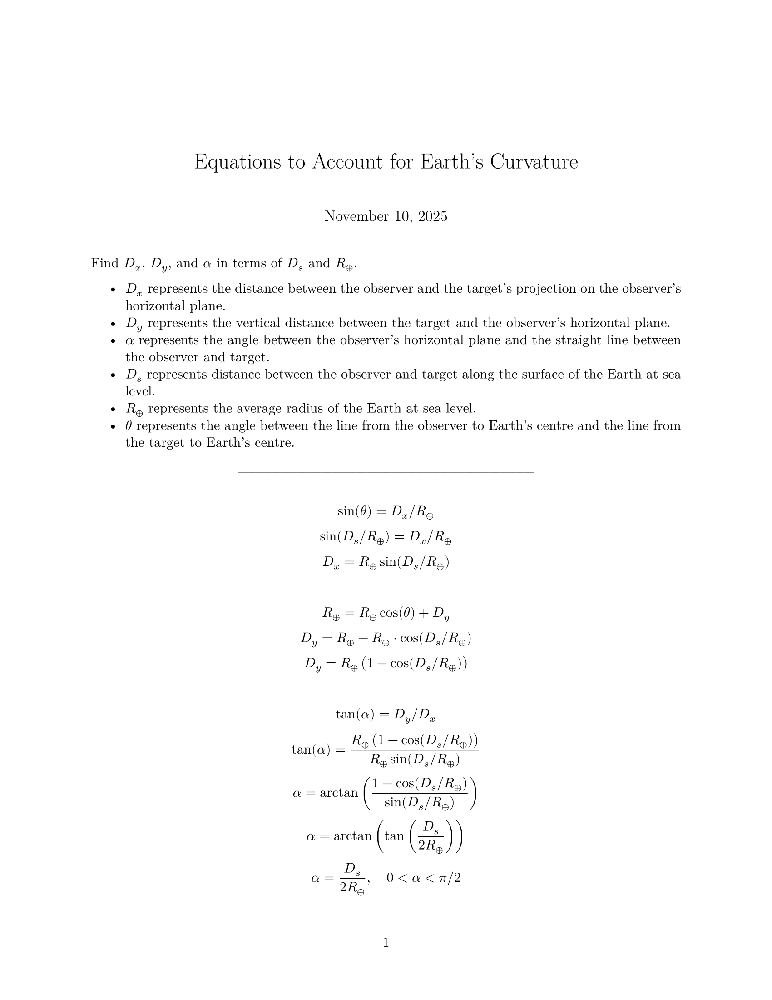
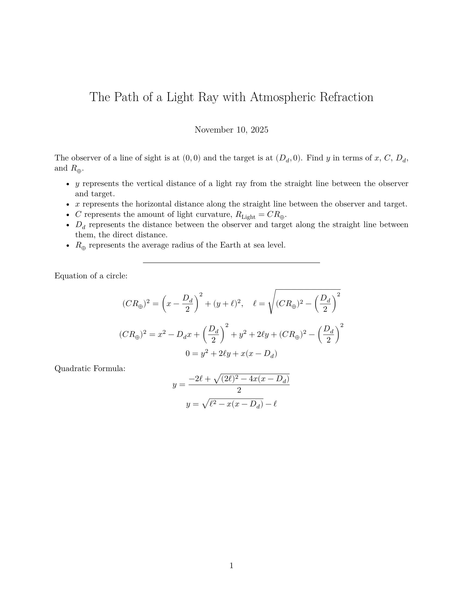
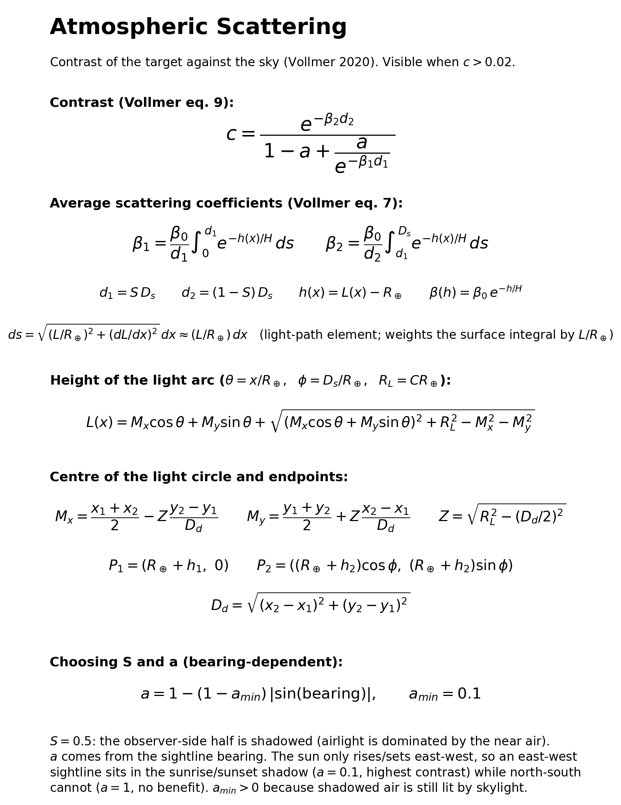
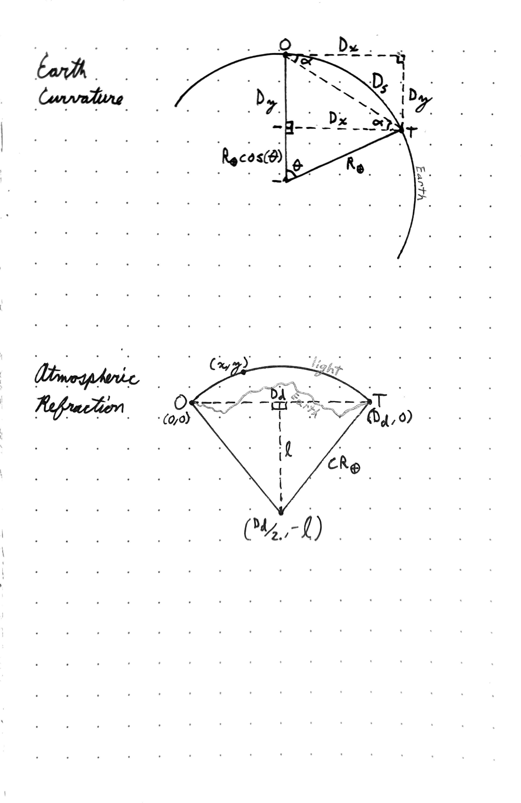

# Pinnacle Points

A pinnacle point is a point from which no higher point can be seen. In other words, when you stand on a pinnacle point you are at the highest elevation in sight. Two points are defined to have line of sight if light can theoretically travel from one to the other unobstructed in clear atmospheric conditions. The curvature of the Earth, atmospheric refraction, local topography, and atmospheric scattering are all taken into account. It is possible for two pinnacle points of equal elevation to have line of sight with each other, since neither is tall enough to disqualify the other.

Interactive Map: https://www.pinnacle-points.com

A full write-up of the method is in [misc/method.txt](misc/method.txt).



**Data Sources:**
1. <a href="https://ototwmountains.com/">On-Top-Of-The-World Mountains</a>
    - On-top-of-the-world (OTOTW) mountains are mountains where no land rises above the horizontal plane through their summit. Any land that rises above that plane would be higher than the summit itself, so a mountain that is not an OTOTW mountain cannot be a pinnacle point. Pinnacle points are therefore a subset of OTOTW mountains. Kai Xu found all 6,464 OTOTW mountains on Earth with over 300 m of prominence, and I have identified which of them qualify as pinnacle points. Andreas Geyer-Schulz deserves mention for his <a href="https://nuntius35.gitlab.io/extremal_peaks/">extremal peaks</a>, a nearly identical concept developed completely independently.
2. <a href="https://www.andrewkirmse.com/prominence-update-2023">Mountains by Prominence</a>
    - Andrew Kirmse and Jonathan de Ferranti found all 11,866,713 summits on Earth with over 100 ft (~30 m) of prominence. Prominence is the minimum vertical distance one must descend from a summit to reach higher ground. Kai Xu identified OTOTW mountains using this dataset, so I use it to identify which OTOTW mountains are pinnacle points. This source primarily uses the Copernicus GLO-30 DEM.
3. <a href="https://www.andrewkirmse.com/true-isolation">Mountains by Isolation</a>
    - Andrew Kirmse and Jonathan de Ferranti found all 24,749,518 summits on Earth with over 1 km of isolation. Isolation is the distance from a summit to the nearest higher point. Extreme isolation makes a summit a strong pinnacle point candidate, so I use this dataset to find every pinnacle point with at least 100 km of isolation. This source uses the SRTM 90 m DEM.
4. <a href="https://open-meteo.com/en/docs/elevation-api">Open-Meteo's Elevation API</a>
    - Open-Meteo offers an elevation API that returns the elevation of any point on Earth. I host this API locally to find the elevation of points between summits that could obstruct line of sight. I also use it to correct a few faulty summit elevations from the other data sources. This source uses the Copernicus GLO-90 DEM.
5. <a href="https://beyondrange.wordpress.com/lines-of-sight/">Beyond Horizons</a>
    - Beyond Horizons has catalogued many of the longest lines of sight ever captured by photograph. I use these confirmed lines of sight to calibrate how strongly light bends from atmospheric refraction over great distances.

**Sources of Error:**
- In the scattering model the shaded ratio is fixed at 0.5 and the shade irradiation ratio is derived from each line of sight's bearing (0.1 for east-west sightlines, which can sit in the sunrise/sunset shadow, up to 1 for north-south ones, which cannot). Real shadow geometry also depends on terrain and the exact position of the sun.
- The sea-level scattering coefficient (Penndorf 1957) accounts for molecular (Rayleigh) scattering only. It ignores aerosols and haze, which dominate real extinction near the ground and vary greatly with conditions.
- Modelling light as the arc of a circle is a common approximation, but the true path of light through the atmosphere is far more complex and depends on many local factors. This is probably the largest source of error.
- There is some inherent error in the elevation data.
- The Earth is approximated as a sphere instead of an ellipsoid for simpler math.
- Only summits with more than 300 m of prominence or more than 100 km of isolation are considered. The prominence threshold comes from the OTOTW dataset. The isolation threshold was chosen as a round number the algorithm can handle in a reasonable amount of time.
- When doing line-of-sight analysis, a discrete set of points between the observer and target are sampled to check whether the ground obstructs the view. The samples are at most 100 m apart, so an obstruction that falls between two samples can be missed. Sampling more densely would find more pinnacle points.

**Project Structure:**
```
PinnaclePoints/
├── data/
│   ├── clean/    # Cleaned-up versions of the datasets
│   │   ├── faulty_pinnacle_points.csv
│   │   ├── known_los.csv               # Confirmed extreme lines of sight
│   │   ├── known_los_with_curvature.csv
│   │   ├── summits_iso.csv             # Cleaned mountains by isolation
│   │   └── summits_prm.csv             # Cleaned mountains by prominence
│   ├── patches/  # Summit patches, one folder per dataset and light curvature
│   ├── raw/      # Raw untouched data straight from the source
│   │   ├── all-peaks-sorted-p100.txt   # Mountains by prominence
│   │   ├── alliso-sorted.txt           # Mountains by isolation
│   │   ├── beyond_horizons.txt         # Longest confirmed lines of sight
│   │   ├── extremals-geojson.js        # Extremal peaks (not used)
│   │   └── ototw_p300m.csv             # On-Top-Of-The-World mountains
│   └── results/  # Data generated by the algorithms
│       ├── longest_los/                # Longest lines of sight found
│       └── pinnacle_points/            # Results from the pinnacle point search
│           ├── iso/                    # From the isolation dataset
│           ├── prm/                    # From the prominence dataset
│           └── prm_iso/                # Combined, final result
├── misc/
│   ├── images/                         # Plots and pictures
│   ├── math/
│   │   ├── formatted/                  # Rendered math (PNG)
│   │   │   ├── atmospheric_refraction.png
│   │   │   ├── atmospheric_scattering.png
│   │   │   ├── diagrams.png
│   │   │   └── earth_curvature.png
│   │   └── raw/                        # Math notebooks
│   │       ├── atmospheric_refraction.ipynb
│   │       ├── atmospheric_scattering.ipynb
│   │       └── earth_curvature.ipynb
│   ├── papers/                         # Relevant scientific papers
│   ├── method.txt                      # Full explanation of the method
│   ├── pinnacle_points.apk             # Pinnacle point app for Android
│   └── pinnacle_points.pptx            # Project presentation
├── scripts/
│   ├── commons.py                  # Shared constants, functions, and classes
│   ├── summit_cleaner.py           # Cleans the prominence and isolation datasets
│   ├── patch_maker.py              # Divides the global summits into patches
│   ├── pinnacle_point_finder.py    # Finds pinnacle points in one dataset
│   ├── pinnacle_point_merger.py    # Merges the isolation and prominence results
│   ├── pinnacle_point_mapper.ipynb # Generates the interactive map (index.html)
│   ├── line_of_sight_finder.py     # Finds the longest lines of sight between prominent summits
│   ├── known_los_parser.ipynb      # Parses confirmed lines of sight from Beyond Horizons
│   └── known_los_analysis.ipynb    # Calibrates light curvature from confirmed lines of sight
├── CNAME              # Needed to host index.html on pinnacle-points.com
├── index.html         # Interactive pinnacle point map
└── README.md          # This file :D
```

**The longest line of sight confirmed by photograph:**


**Relevant Mathematics:**

The notation below is shared with [misc/method.txt](misc/method.txt) and the notebooks in `misc/math/raw/`.

<p align="center">
    
    
</p>
<p align="center">
    
    
</p>
