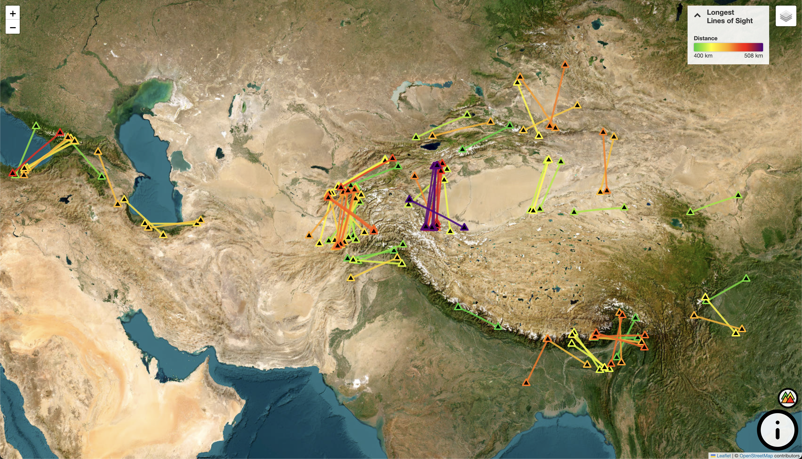
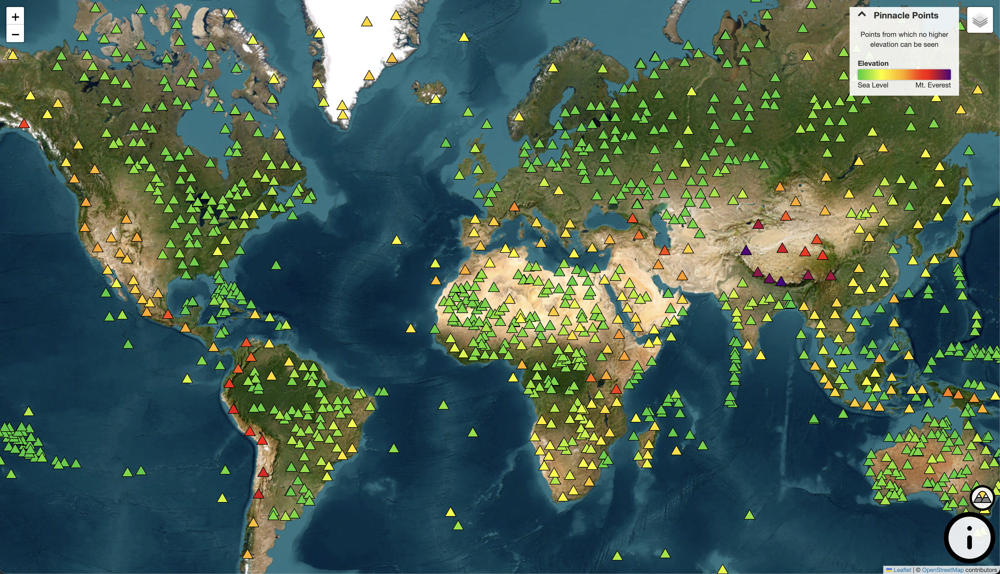
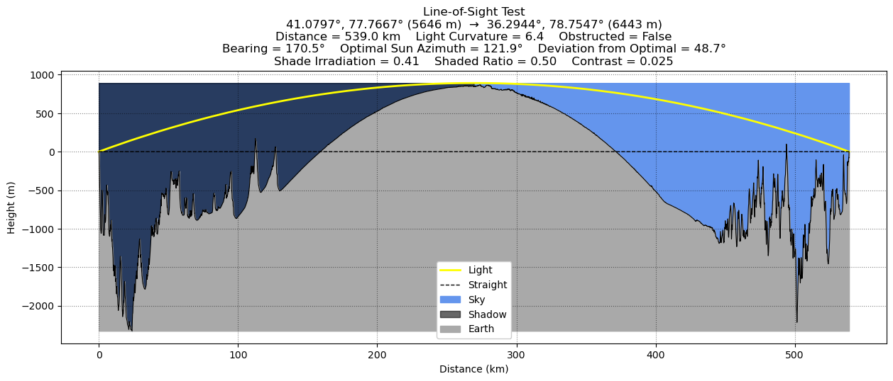
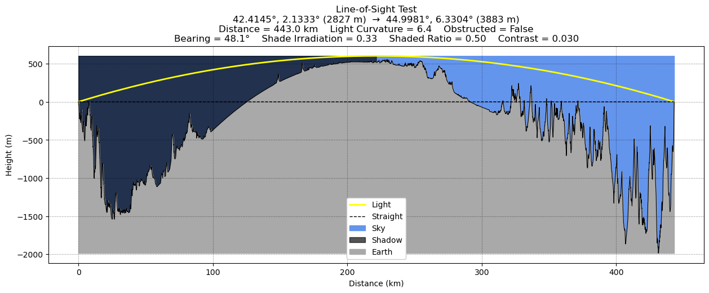

# The Longest Lines of Sight Earth and Pinnacle Points

Two points have line of sight if light can travel from one to the other unobstructed and with enough contrast to be visible under clear atmospheric conditions. Deciding whether two points can see each other means modelling many physical phenomena: Earth's curvature, local topography, atmospheric refraction, atmospheric scattering, and partial irradiation. This project applies a line-of-sight model that considers these phenomena to two problems.

**1. The longest lines of sight.** Every pair of summits that could plausibly see one another is tested to find the longest ground-to-ground lines of sight on Earth. Only lines of sight that are over 400 km long and between summits with more than 500 m of prominence each are considered.

**2. Pinnacle points.** A pinnacle point is a point from which no higher elevation can be seen. This project identifies every pinnacle point on Earth with at least 300 m of prominence or 100 km of isolation. Two pinnacle points of equal elevation can still see each other, since neither is high enough to disqualify the other.

A full write-up of the method is in <a href="misc/method.txt" target="_blank" rel="noopener noreferrer">misc/method.txt</a>.


## Interactive Maps

- **<a href="https://www.pinnacle-points.com/longest-lines-of-sight" target="_blank" rel="noopener noreferrer">Longest Lines of Sight</a>** — The longest lines of sight on Earth
- **<a href="https://www.pinnacle-points.com" target="_blank" rel="noopener noreferrer">Pinnacle Points</a>** — Every pinnacle point on Earth

<p align="center">
  <a href="https://www.pinnacle-points.com/longest-lines-of-sight" target="_blank" rel="noopener noreferrer"></a>
  <a href="https://www.pinnacle-points.com" target="_blank" rel="noopener noreferrer"></a>
</p>


## Plots

**The longest line of sight theoretically possible (from this project):**


**The longest line of sight confirmed by photograph:**



## Data Sources

1. <a href="https://ototwmountains.com/" target="_blank" rel="noopener noreferrer">On-Top-Of-The-World Mountains</a>
    - On-top-of-the-world (OTOTW) mountains are mountains where no land rises above their horizontal plane. Since any land that rises above that plane would be higher than the mountain itself, a mountain that is not an OTOTW mountain cannot be a pinnacle point. In other words, pinnacle points are a subset of OTOTW mountains. Kai Xu found all 6,464 OTOTW mountains on Earth with over 300 m of prominence, and I identify which of them qualify as pinnacle points.
2. <a href="https://www.andrewkirmse.com/prominence-update-2023" target="_blank" rel="noopener noreferrer">Mountains by Prominence</a>
    - Andrew Kirmse and Jonathan de Ferranti found all 11,866,713 summits on Earth with over 100 ft (~30 m) of prominence. Prominence is the minimum vertical distance one must descend from a summit to reach higher ground. This dataset is used to determine which OTOTW mountains qualify as pinnacle points, and to select the summits above the 500 m prominence threshold used in the search for the longest lines of sight.
3. <a href="https://www.andrewkirmse.com/true-isolation" target="_blank" rel="noopener noreferrer">Mountains by Isolation</a>
    - Andrew Kirmse and Jonathan de Ferranti found all 24,749,518 summits on Earth with over 1 km of isolation. Isolation is the distance from a summit to the nearest higher point. Extreme isolation makes a summit a strong pinnacle point candidate, so this dataset is used to find every pinnacle point with at least 100 km of isolation.
4. <a href="https://open-meteo.com/en/docs/elevation-api" target="_blank" rel="noopener noreferrer">Open-Meteo's Elevation API</a>
    - Open-Meteo offers an elevation API that returns the elevation of any point on Earth. It is used to find the elevation of points between summits that could obstruct line of sight.
5. <a href="https://beyondrange.wordpress.com/lines-of-sight/" target="_blank" rel="noopener noreferrer">Beyond Horizons</a>
    - Beyond Horizons has catalogued many of the longest lines of sight to ever be captured by photograph. These confirmed lines of sight are used to calibrate the way light bending is modelled from atmospheric refraction.


## Project Structure
```
PinnaclePoints/
├── data/
│   ├── clean/    # Cleaned-up versions of the datasets
│   │   ├── faulty_pinnacle_points.csv     # Manual corrections to misidentified summits
│   │   ├── known_los.csv                  # Confirmed extreme lines of sight
│   │   ├── known_los_with_curvature.csv   # Confirmed lines of sight with calibrated curvature
│   │   ├── summits_iso.csv                # Cleaned mountains by isolation
│   │   └── summits_prm.csv                # Cleaned mountains by prominence
│   ├── patches/  # Summit patches, one folder per dataset and light curvature
│   │   ├── iso_6.4/
│   │   ├── prm_6.4/
│   │   └── prm_iso_6.4/
│   ├── raw/      # Raw untouched data straight from the source
│   │   ├── all-peaks-sorted-p100.txt      # Mountains by prominence
│   │   ├── alliso-sorted.txt              # Mountains by isolation
│   │   ├── beyond_horizons.txt            # Longest confirmed lines of sight
│   │   ├── extremals-geojson.js           # Extremal peaks (not used)
│   │   └── ototw_p300m.csv                # On-Top-Of-The-World mountains
│   └── results/  # Data generated by the algorithms
│       ├── longest_los/                   # Longest lines of sight found
│       └── pinnacle_points/               # Results from the pinnacle point search
│           ├── iso/                       # From the isolation dataset
│           ├── prm/                       # From the prominence dataset
│           └── prm_iso/                   # Combined, final result
├── misc/
│   ├── images/                            # Plots and figures
│   ├── math/
│   │   ├── formatted/                     # Rendered math (PDF)
│   │   │   ├── atmospheric_refraction.pdf
│   │   │   ├── atmospheric_scattering.pdf
│   │   │   └── earth_curvature.pdf
│   │   └── raw/                           # Math source (Markdown)
│   │       ├── atmospheric_refraction.md
│   │       ├── atmospheric_scattering.md
│   │       └── earth_curvature.md
│   ├── papers/                            # Relevant scientific papers
│   ├── method.txt                         # Full explanation of the method
│   ├── pinnacle_points.apk                # Pinnacle point app for Android
│   └── pinnacle_points.pptx               # Project presentation
├── scripts/
│   ├── commons.py                         # Shared constants, functions, and classes
│   ├── summit_cleaner.py                  # Cleans the prominence and isolation datasets
│   ├── patch_maker.py                     # Divides the global summits into patches
│   ├── pinnacle_point_finder.py           # Finds pinnacle points in one dataset
│   ├── pinnacle_point_merger.py           # Merges the isolation and prominence results
│   ├── pinnacle_point_mapper.py           # Generates the pinnacle point map (index.html)
│   ├── line_of_sight_finder.py            # Finds the longest lines of sight between prominent summits
│   ├── line_of_sight_mapper.py            # Generates the longest lines of sight map (longest-lines-of-sight.html)
│   ├── confirmed_los_parser.py            # Parses confirmed lines of sight from Beyond Horizons
│   ├── confirmed_los_curvature_finder.py  # Calibrates light curvature from confirmed lines of sight
│   └── general_analysis.ipynb             # Assorted analysis and figures
├── CNAME                  # Needed to host the maps on pinnacle-points.com
├── index.html             # Interactive pinnacle point map
├── longest-lines-of-sight.html  # Interactive longest lines of sight map
└── README.md              # This file :D
```
